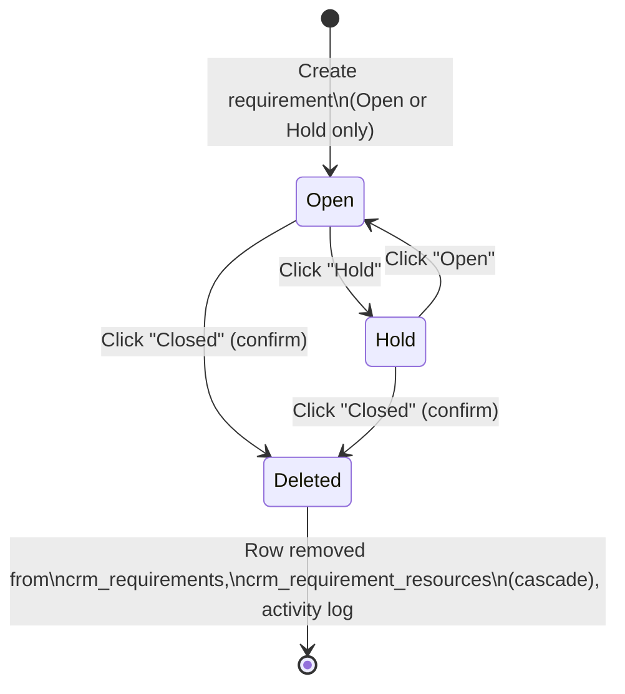
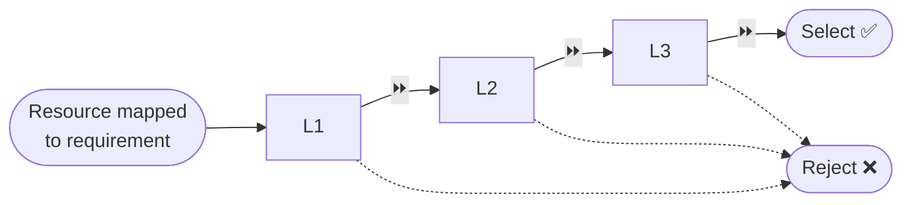
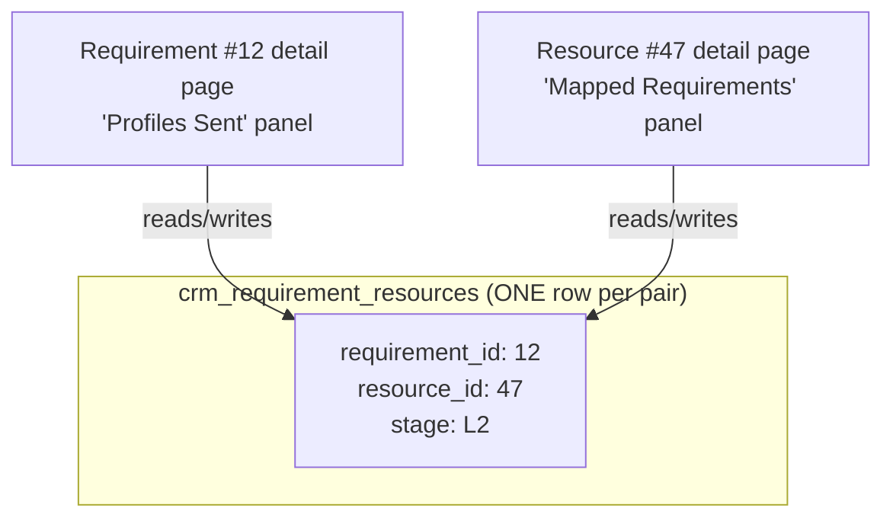
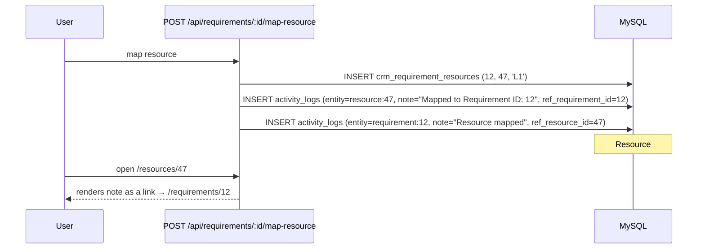
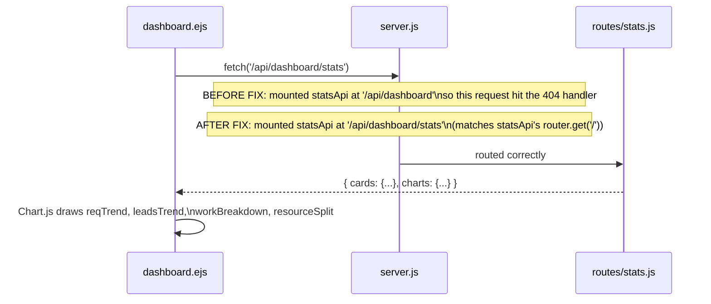

# CWA CRM — Feature & Workflow Documentation
_Covers the update delivered on top of `crm-v3-FIXED.zip`. Read this alongside `migration_v5.sql`._

---

## 1. What changed, at a glance

| # | Request | What was built |
|---|---------|-----------------|
| 1 | Requirement ID on a resource's log should link to that requirement | Activity-log entries now carry `ref_requirement_id`; the resource page renders a clickable "Requirement #X — Title" badge |
| 2A | Requirement status: Open / Hold / Closed(auto-delete) | New 2-value status enum (`Open`,`Hold`) + a "Closed" **action** that deletes the requirement everywhere |
| 2B | 5-stage pipeline per resource sent (L1/L2/L3/Reject/Select), synced both ways | New `crm_requirement_resources` table read by both the requirement page and the resource page |
| 3 | Add-requirement form: Open/Hold only, colored buttons | `views/requirements/add.ejs` status field replaced |
| 4 | Employee "Access Denied" bug | `clientsPage.js` / `vendorsPage.js` were blocking ALL employees from viewing Clients/Vendors — fixed to view-only-for-everyone, admin-only-to-add |
| 5 | Proper code comments | Every new/changed route and template has inline comments explaining *why*, not just *what* |
| 6 | This document | You're reading it |
| 7 | Dashboard works for every role | Was already role-agnostic in principle; broke in practice because of bug #8 |
| 8 | Dashboard charts not rendering | `server.js` mounted the stats API at the wrong path (`/api/dashboard` instead of `/api/dashboard/stats`) — every stats request 404'd silently and the chart script crashed before drawing anything |

---

## 2. Role-based access matrix

| Page / Action | super_admin | admin | emp |
|---|:---:|:---:|:---:|
| Dashboard | ✅ (all data) | ✅ (all data) | ✅ (own requirement numbers only) |
| Requirements — list/view | ✅ all | ✅ all | ✅ **own only** |
| Requirements — create | ✅ | ✅ | ✅ (owns what they create) |
| Requirements — edit/delete/status | ✅ all | ✅ all | ✅ own only |
| Resources — list/view/manage | ✅ | ✅ | ✅ |
| Resource pipeline stage (L1..Select) | ✅ | ✅ | ✅ (only on requirements they own) |
| Clients / Vendors — **view** | ✅ | ✅ | ✅ *(fixed — was blocked)* |
| Clients / Vendors — **add/edit/delete** | ✅ | ✅ | ❌ |
| Team / member management | ✅ | ✅ | ❌ |

The emp ownership rule (`created_by = session.user.id`) is enforced **server-side** on every relevant route — not just hidden in the UI — so it can't be bypassed by guessing a URL.

---

## 3. Requirement status workflow (Point 2A / 3)



**Why "Closed" deletes instead of storing a status:** the spec was explicit —
*"Jaise hi closed ho jaye wo automatic delete ho jayega har jagha se"*. So there
is no `Closed` value in the database `status` enum at all. `POST
/api/requirements/:id/status` with `{status:'Closed'}`:

1. Deletes the requirement's own activity-log entries.
2. Deletes the requirement row — this **cascades** to `crm_requirement_resources`
   (every pipeline entry for it disappears too).
3. Any resource-side log entry that mentioned this requirement keeps its text
   but its link goes null (`ON DELETE SET NULL`) — history isn't erased, it
   just stops being clickable.
4. Any resource no longer actively mapped to *anything else* flips back to
   `Available`.

Colors: **Open = green**, **Hold = grey**, **Closed = red** (used consistently
on the list page, the detail page header, and the add-requirement form).

---

## 4. Resource duplicate-UID check (recap, unchanged from the earlier fix)

```
UID = VENDORCODE-RESOURCENAME-TECH-COUNT     e.g. INH-SHUBHAM-JAVA-1
```

| Same vendor? | Same name? | Same skill? | Result |
|---|---|---|---|
| ✅ | ✅ | ✅ | **Blocked** — "⚠️ A duplicate was found and is not allowed" |
| ✅ | ✅ | ❌ | Allowed — new profile, COUNT increments |
| ❌ | ✅ | ✅ | Allowed — different vendor code, COUNT restarts at 1 |

Enforced with a row lock (`FOR UPDATE`) inside a transaction so two
simultaneous submissions can't both slip past the check.

---

## 5. Resource pipeline: L1 → L2 → L3 → Select / Reject (Point 2B)



**Single source of truth:** every "resource sent against a requirement" is one
row in `crm_requirement_resources (requirement_id, resource_id, stage)`.



Because both screens point at the *same* row, clicking `L2` on the requirement
page and then opening the resource page shows `L2` there too — there is
nothing to "sync", there was only ever one number. Every stage change also
writes one activity-log line on the requirement's timeline and one on the
resource's timeline (`PATCH /api/requirements/:id/resource/:resourceId/stage`
in `routes/requirements.js`).

Button colors: **L1/L2/L3 = green arrow style (⏩)**, **Select = solid
green**, **Reject = solid red**.

---

## 6. Requirement ⇄ Resource activity-log linking (Point 1)



Previously the requirement ID was written into the note text as a **literal
placeholder string `<?>`** instead of a bound SQL parameter, so it never
appeared at all. It's now a real bound value AND a real foreign key
(`ref_requirement_id`), so the frontend can render an actual `<a href="/requirements/12">`
link instead of trying to parse text.

---

## 7. Dashboard — chart data flow & the bug that was fixed (Points 7 & 8)



**Root cause:** `server.js` had `app.use('/api/dashboard', statsApi)`, but
`dashboard.ejs` calls `fetch('/api/dashboard/stats')` and `statsApi`'s handler
is defined at `router.get('/')`. That combination means the real working URL
was `/api/dashboard`, not `/api/dashboard/stats` — every dashboard page load
silently 404'd, the destructured `{cards, charts}` came back `undefined`, and
the whole chart-drawing script threw before Chart.js ever ran. This is why it
looked like "charts don't rebuild when I add a requirement/resource" — they
never rendered in the first place, on any page load, for any role.

**Fix:** mount path corrected to `/api/dashboard/stats` in `server.js`. Also
added a `try/catch` around the whole dashboard script so a future API failure
shows a small error message instead of silently breaking the page.

**Role scoping:** `routes/stats.js` now scopes the requirement-related cards
(`reqToday`, `reqMonth`, `openReqs`, `holdReqs`, and the `reqTrend` chart) to
`created_by = session.user.id` when the logged-in user is an `emp`, matching
the same "employee sees only their own" rule used everywhere else.
Master-data totals (`resourcesTotal`, `clientsTotal`, `vendorsTotal`,
`leadsMonth`) stay company-wide for every role since that data isn't "owned"
by any one person.

---

## 8. Database migration

Run **`migration_v5.sql`** once, after `migration_v3.sql`, in phpMyAdmin's
SQL tab (or `mysql -u root -p crm_db < migration_v5.sql`).

> ⚠️ **Back up your database first.** The migration deletes any requirement
> currently sitting in the old `Closed` status, to match the new rule that
> Closed requirements don't get stored at all.

What it does, step by step, is documented inline in the SQL file itself:
1. Removes already-`Closed` requirements (and their activity-log entries).
2. Converts the `status` enum from `(InProcess, Closed)` to `(Open, Hold)`,
   mapping existing `InProcess` rows to `Open`.
3. Creates `crm_requirement_resources` (the pipeline table) and backfills it
   from existing activity-log history so no previously-sent resource is lost
   — all backfilled rows start at stage `L1` since the old system had no
   stage concept.
4. Adds `ref_requirement_id` to `crm_activity_logs` for the clickable link
   feature. New entries going forward get it automatically; old "Mapped to
   Requirement ID" text entries from before this update are **not**
   retroactively linked (the ID was never actually saved correctly before —
   see Section 6 — so there's nothing reliable to parse it back out of).

---

## 9. File-by-file summary

| File | Change |
|---|---|
| `schema.sql` | Fresh-install schema updated to the new status enum + pipeline table + `ref_requirement_id` |
| `migration_v5.sql` | **New.** Upgrades an existing database in place |
| `server.js` | Fixed `/api/dashboard/stats` mount path |
| `routes/requirements.js` | Open/Hold/Closed(=delete) status logic, pipeline stage endpoint, map-resource now writes `ref_requirement_id` and a pipeline row, ownership checks throughout |
| `routes/requirementsPage.js` | `resourcesSent` now joins the pipeline table for live `stage` |
| `routes/resourcesPage.js` | Activity query joins `crm_requirements` for the clickable link; new `mappedRequirements` query for the stage panel |
| `routes/stats.js` | Rewritten: Open/Hold cards, employee-scoped requirement numbers, heavily commented |
| `routes/clientsPage.js`, `routes/vendorsPage.js` | View access opened to all logged-in roles; add-page stays admin-only |
| `views/requirements/list.ejs` | Open/Hold badge colors |
| `views/requirements/add.ejs` | Open/Hold button toggle replacing the old dropdown |
| `views/requirements/detail.ejs` | 3-button status toggle, 5-stage pipeline buttons per sent resource, clickable resource badges |
| `views/resources/detail.ejs` | Clickable requirement badge in activity log, new "Mapped Requirements" panel with the same 5-stage buttons |
| `views/dashboard.ejs` | Hold Requirements card, Open/Hold badge colors, defensive error handling |

---

## 11. Troubleshooting: "Access Denied" / "This site can't be reached"

### Admin gets blocked / "access denied"
**Root cause found:** `middleware/license.js` runs on every page for every
role except `super_admin`. It used to treat "no license row exists yet" the
same as "license expired" — so on a brand-new setup, before any Super Admin
had ever opened **Super Admin → License** and activated one, *every* Admin
and Employee was blocked with a 402 license page from their very first login.
**Fixed:** a missing license (not configured yet) now lets requests through;
only a license row that has actually passed its `valid_until` date blocks
access. If you still see this page, log in as the Super Admin account and
set a license under **Super Admin → License**.

### "This site can't be reached" (browser connection error)
This specific error means the Node process itself isn't answering on that
address/port at all — it's not something a page-level fix can solve, it
means the server isn't running (or isn't reachable from that device). Check,
in this order:
1. **Is the server actually running?** Look at the terminal where you ran
   `node server.js` / `npm start` — if it printed an error and exited, that's
   the real cause. Common ones after unzipping a fresh copy:
   - `Cannot find module 'express'` (or similar) → you need to run
     `npm install` inside the `crm-v3` folder first (this project's zip does
     **not** include `node_modules` to keep the download small).
   - A MySQL connection error → check your DB host/user/password/database
     name in `db.js` (or your `.env` if you've wired one up) match your
     actual MySQL server.
2. **Are you opening the right address?** `http://localhost:3000` only works
   on the *same machine* the server is running on. Employees on other
   computers need the server machine's actual network IP (e.g.
   `http://192.168.1.20:3000`) or a proper domain, and the server's firewall
   must allow inbound connections on that port.
3. **Restart after every file change.** If you're not using `npm run dev`
   (nodemon), the server needs a manual restart (`Ctrl+C` then
   `node server.js` again) to pick up any of the changes in this update.
4. Once it's running, `http://<server-address>:3000/api/health` should
   return `{"status":"ok","db":"connected",...}` — if that also fails to
   load, the problem is 100% server/network, not the app.

## 13. v6 update — table columns, search scoping, self-service profile

### Critical bug fixed
`routes/requirementsPage.js` had a typo — it queried a table called
`crm_requirements_resources` (extra "s") instead of the real table
`crm_requirement_resources`. This made **every requirement detail page**
throw a database error. Fixed.

### Resources table
Columns are now, in order: **Unique ID, Name, Vendor Name, Budget, Skills,
[Submit EmpName — admin/super_admin only], Type, Profile, Submit Status,
Location**. Every column has a fixed max-width with automatic `...`
truncation for overflow text (`.ellipsis` / `.resource-table` CSS in
`views/resources/list.ejs`). "Profile" is a quick link/icon to the uploaded
CV when one exists. The Type filter (In-House/Vendor) and the search box
both now read from reliable `data-*` attributes set server-side, instead of
guessing table-cell positions — the old version could silently break if a
column was ever added or removed.

### Search scoping
- **Global search** (the one in the top bar) now only appears on the
  **Dashboard** — every other page includes the same topbar partial but
  without the flag that turns the search box on, so it's simply absent
  there.
- **Requirements list** has its own local search box that filters only
  requirements (title/client/status/budget) — it never touches
  `/api/search` and never shows resources.
- **Resources list** search (already existed) filters only resources —
  confirmed unchanged, still resource-only.

### Profile — self-service
Any logged-in user (any role) can now, from **My Profile**:
- Upload/change their own profile picture (shows in the topbar and on the
  profile page itself)
- Change their own display name
- Change their own password (already existed)

Run **`migration_v6.sql`** to add the `avatar_path` column this needs.

### Dashboard — Profiles Sent
Added a **Profiles Sent (Today)** card next to the existing (Month) one.
Both now follow the same ownership rule as the rest of the dashboard:
Admin/Super Admin see the company-wide total, an Employee sees only the
profiles **they personally** sent.

## 14. Quick test checklist

- [ ] Run `migration_v6.sql` (after v5), restart the server
- [ ] Open Resources list → confirm columns match the spec, long text truncates with "...", Type filter and search box work
- [ ] Log in as `emp` → Resources list should NOT show "Submit EmpName" column
- [ ] Open `/profile` → upload a photo, change your name → both should reflect immediately in the topbar
- [ ] Global search box should appear only on the Dashboard, nowhere else
- [ ] Requirements list search should only ever show requirements; Resources list search should only ever show resources
- [ ] Dashboard → "Profiles Sent (Today)" appears; as `emp`, both Today/Month cards match only your own submissions


- [ ] Run `migration_v5.sql`, then restart the server (`npm install` first if this is a fresh unzip)
- [ ] Log in as Super Admin → **Super Admin → License** → confirm a license is active (or set one) — Admin/Employee logins depend on this
- [ ] Log in as `emp` → confirm Requirements list shows only their own, dashboard numbers match
- [ ] Log in as `emp` → open `/clients` and `/vendors` → should load (view-only), `/clients/add` should say Access Denied
- [ ] Create a requirement → status defaults to Open (green)
- [ ] Toggle Open ⇄ Hold a few times → badge color updates
- [ ] Click Closed → confirm dialog → requirement disappears from the list, its mapped resources go back to Available (if not mapped elsewhere)
- [ ] Map a resource to a requirement → resource's activity log shows a clickable "Requirement #X" badge → click it → lands on the requirement
- [ ] On the requirement page, move a resource to `L2` → open that resource's own page → confirm it also shows `L2`
- [ ] Reload the dashboard → stat cards and all four charts render (Requirements Trend, Leads Trend, Work Breakdown, Resource Split)
- [ ] Try adding a duplicate resource (same vendor + name + skill) → blocked with the duplicate warning
